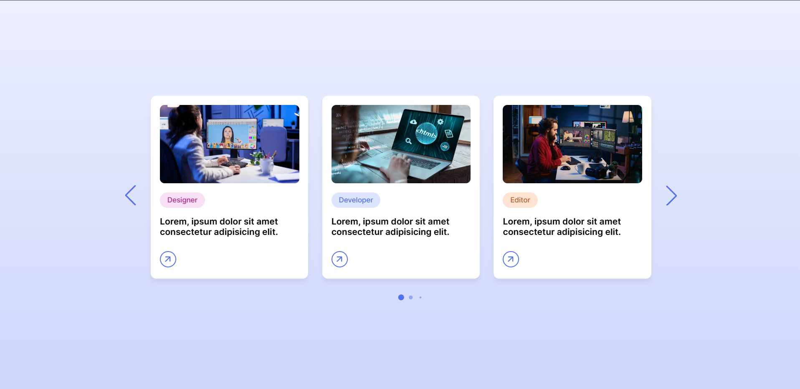

# Card Slider Demo 🎴

A responsive **card slider (carousel) demo** built using **HTML, CSS, JavaScript**, and **Swiper.js**.  
This project demonstrates a modern card-based UI with smooth animations, pagination, and navigation controls.

## 🚀 Features

- 📱 Fully responsive design (mobile, tablet, desktop)
- 🔁 Infinite looping slider
- 🎯 Pagination bullets & navigation arrows
- 🎨 Modern card layout with hover effects

## 🛠️ Technologies Used

- HTML5
- CSS3
- JavaScript (ES6)
- Swiper.js v12
- Google Fonts (Inter)
- Material Symbols Icons

## 📸 Preview

<table align="center" border="0" cellspacing="0">
  <tr>
    <td align="center" width="50%">
      
    </td>
  </tr>
</table>
