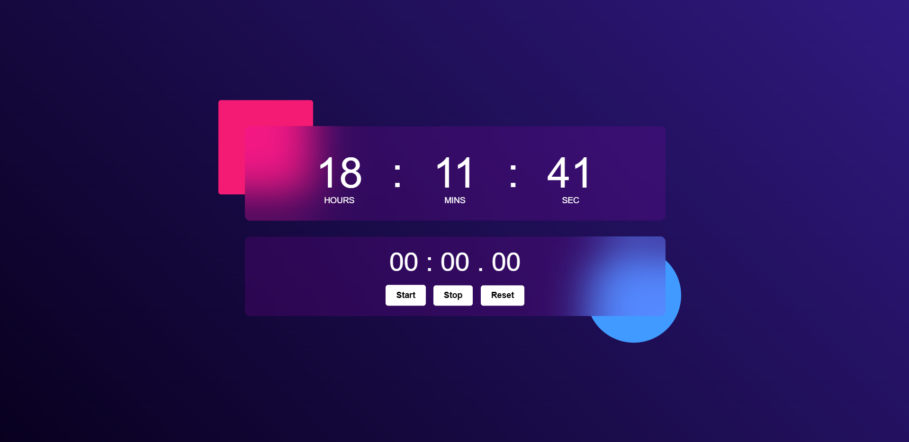

# ⏰ Digital Clock & Stopwatch

A simple and elegant **Digital Clock** combined with a **Stopwatch**, built using **HTML**, **CSS**, and **JavaScript**.  
The UI features a modern glassmorphism style with gradient backgrounds and smooth layout.

## 🚀 Features

### 🕒 Digital Clock
- Automatically displays the current time.
- Live updates every second using `setInterval`.
- Stylish design with blur effect and neon gradient background.

### ⏱️ Stopwatch
- Measures **minutes**, **seconds**, and **milliseconds**.
- **Start**, **Stop**, and **Reset** buttons.
- Accurate timing using `setInterval` with 10ms ticks.

## 📸 Preview

<table align="center" border="0" cellspacing="0">
  <tr>
    <td align="center" width="50%">
      
    </td>
  </tr>
</table>
