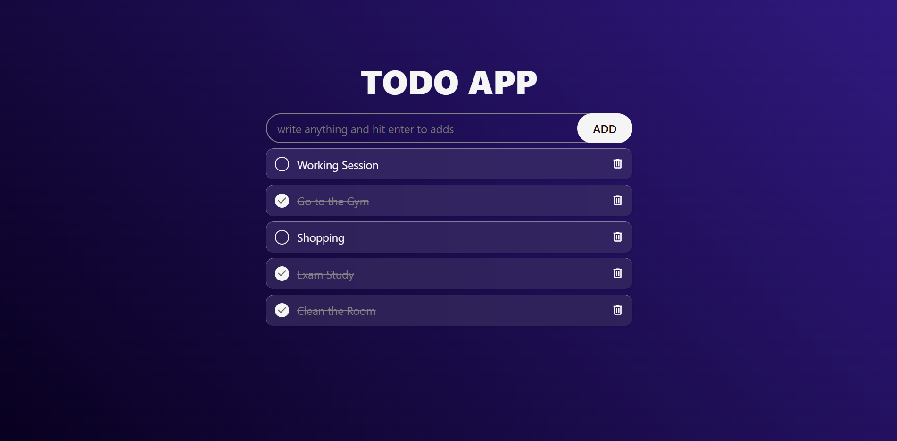

# 📝 ToDo App

A simple, stylish, and functional **To-Do List Web Application** built with **HTML, CSS, and JavaScript**.  
This app allows users to add tasks, mark tasks as complete, and delete tasks — with full support for **localStorage**, ensuring tasks stay saved even after refreshing the page.

## 🚀 Features

- ➕ **Add new tasks** using the input field
- ✔️ **Mark tasks as completed** using a custom circular checkbox
- 🗑️ **Delete tasks** instantly
- 💾 **Tasks are stored in localStorage** (persistent data)
- 🎨 **Modern and responsive UI**
- 📱 Fully responsive design for mobile screens

## 📸 Preview

<table align="center" border="0" cellspacing="0">
  <tr>
    <td align="center" width="50%">
      
    </td>
  </tr>
</table>
